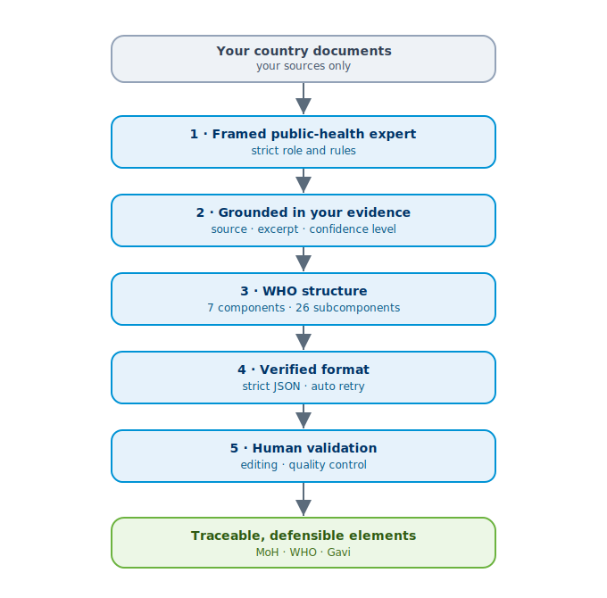

# User Guide — National Immunization Strategy (NIS) Builder

*For country teams. No technical skills required.*

---

## 1. What is this platform?

This online tool guides you **step by step** to develop your **National Immunization Strategy (NIS)**, based on the WHO *“All-in-1 SWOT to Activities”* tool. It takes you from **situation analysis** all the way to **operational activities**, with:

- **AI-assisted generation** from your own documents;
- the ability to **edit and validate** every section by hand;
- **professional exports**: Excel, Word, PDF and PowerPoint.

> The AI **never invents information**: every generated item cites its **source**, a **supporting excerpt** and a **confidence level**. Anything missing is marked *“To be completed by the country team.”*

---

## 2. Accessing the app

1. Open the app link in your browser (Chrome, Edge, Safari…).
2. In the **left sidebar**, choose the **language**: *Français* or *English*.
3. Move between **steps 0 to 10** by clicking them in the sidebar.

> 💤 If the app is “asleep” (after long inactivity), a **“Yes, get this app back up!”** button appears — click it and it restarts in ~30 seconds.

---

## 3. ⭐ Golden rule: save and resume

Your work lives in the **browser session**. To **never lose it**:

- At the end of each session, go to **“10 · Exports”** and **download the `.json` backup file**.
- To **resume later**: go to **“0 · Country profile”** → **“♻️ Resume a project (.json)”** panel → upload your file → **Load this project**. Everything is restored.

> 💡 Tip: name your files clearly, e.g. `NIS_Djibouti_2025-06-24.json`.

---

## 4. The steps, one by one

### Step 0 — Country profile
Fill in: country, ministry, EPI programme name, **start year**, **duration** (3–6 years), currency, focal point.
- **“♻️ Resume a project”** panel: import previous work.
- **“🇩🇯 Load Djibouti example”** panel: see a pre-filled demonstration (illustrative only).

### Step 1 — Source documents
1. Choose the document **category** (previous NIS, EPI review, coverage, etc.).
2. **Drag and drop** your files (`.docx .xlsx .pptx .pdf .csv .txt`).
3. Click **“📥 Extract content.”**
Documents appear in a list; you can delete any of them.
> 🔒 Documents are processed **temporarily**. Only upload what is needed for the analysis.

### Step 2 — Country vision
Click **“✨ Generate with AI”** to propose a **vision (~10 years)**, a **goal** and an **overall objective**, aligned with IA2030, equity and zero-dose children. **Edit** the text freely, then **“Validate this section.”**

### Step 3 — SWOT analysis
For each **EPI component** (7 components, 26 subcomponents), enter:
- **Strengths** and **Weaknesses** = INTERNAL to the programme;
- **Opportunities** and **Threats** = EXTERNAL.
Type **one idea per line**. The AI can pre-fill; you correct.

### Step 4 — Root cause analysis (5-Whys)
For each **weakness**, follow the chain of **WHYs** down to the **root cause** (“Final WHY”). Add as many rows as needed.

### Step 5 — Obstacles & objectives
1. Choose a **grouping option**:
   - *Option 1*: one obstacle per **subcomponent** (≥26);
   - *Option 2*: one obstacle per **component** (≥7);
   - *Option 3*: **context-specific** grouping proposed by the AI.
2. For each obstacle: formulate the **main problem**, the **visionary result** and a **SMART strategic objective**.

### Step 6 — Interventions & prioritization
For each objective, propose **3 to 5 interventions**. For each one:
- title, rationale, expected impact;
- **multi-criteria scoring** (8 criteria scored **3 = best / 2 / 1 = weak**); the **total score** (out of 24) gives the **priority level**:
  - **High**: 17–24 · **Medium**: 9–16 · **Low**: 1–8;
- **timeline** over the period (ticked years).
You can **adjust all scores** by hand.

### Step 7 — Monitoring & evaluation (M&E)
For each objective, define **at least one indicator**: name, type (impact/outcome/output/process), definition, formula, sources, frequency, responsible parties, **baseline**, and **progressive yearly targets**.
> If the baseline is unknown: *“Baseline to be confirmed by the country team.”*

### Step 8 — Operational activities
Break each intervention into **key activities**: implementation level (national, district, community…), **yearly calendar**, lead, partners, prerequisites, risks, deliverables. *(Compatible with future NIS.COST costing.)*

### Step 9 — Quality control
Check **completeness**: missing fields, uncovered components, objectives without indicators, interventions without activities, non-progressive targets… **Export stays locked** until the key sections are complete and **validated**.

### Step 10 — Exports
Once validation is confirmed, download:
- **Excel** (reproduces the WHO tool structure);
- **Word** (full narrative report);
- **PDF** (paginated layout, header, logo);
- **PowerPoint** (decision-maker deck);
- **`.json` backup** (keep it to resume — see §3).

---

## 5. Using the AI well

- Click **“✨ Generate with AI”** on each step; the AI relies **only** on your documents.
- **Always review**: check figures, fill in the *“To be completed”* items, refine the wording.
- Without a configured AI key, the app runs in **manual mode** (type everything by hand).

### How the AI produces quality elements

Quality comes from a **chain of safeguards**: a framed expert → grounded only in your evidence → following the WHO structure → in a verified format → validated by humans.

## 6. Edit & validate

All generated content is **editable**. After review, click **“Validate this section.”** Validation is **required** before final export.

---

## 7. Frequently asked questions

**Did the app lose my work?** → If you didn’t import a backup, the session may have expired. Resume from your `.json` file (step 0).

**Can several countries use it?** → Yes, but each manages **its own `.json` file** (no separate per-country space yet).

**Are my documents confidential?** → They are processed temporarily for the analysis. Upload only what is needed and keep your originals.

**A “credit balance” error appears?** → The AI account needs credits; **manual mode** remains usable.

---

*For any question, contact your NIS focal point or the platform administrator.*
